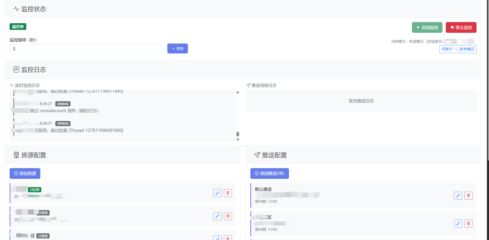

# 当前项目仅仅提供学习思路，请勿进行不合法行为！

首先如果不是在网页获取连接信息，如果是小程序，不好调试，首先我们准备下载抓包程序 https://github.com/wanghongenpin/proxypin。具体使用参考readme学习，相对简单。
如果是网页版本，我们直接打开F12开发者工具即可。

当我们拿到连接返回的前后端信息，就写代码循环，可以参考提供的案例代码house_monitor.py。

## 这是初版的循环查询，只能用参考

注意，当前代码已经不适应了，坚持运行会被风控IP。
建议个人找个合适的AI自己进行修改并自行验证

## 以上对程序员同学来说相对简单，可能只是发送消息。

思路：1.寻找做好的公众号，因为自己的有粉丝要求，并且万一封了，可以使用spug（不是广告）。

2.自己找个不用的微信号，做机器人通知，比较简单，一般都是机器人放在群里。

3.在TG用自己的机器人做推送。

为了自己好受加了一些友好UI，暂不放逻辑了，大家可以模拟我的样式自行扩展。

另外建议不要做自动抢的逻辑，费力不讨好。

目前仓库有：

**Web版**  24小时监控、远程访问、多人使用，做了指定监控。

**增强版GUI** 本地监控 （做了授权试用认证+代码混淆，防止软件被非法售卖）

## 免责声明

1.项目性质
本项目为个人技术学习与交流用途的开源脚本，并非商业产品或服务。作者仅提供代码与技术实现思路，不对使用该脚本产生的任何后果负责。

2.合法使用
使用者应遵守目标网站的服务条款（如 robots.txt、API使用限制等），并确保在合法范围内使用本脚本。禁止用于以下用途：

恶意爬取、干扰目标网站正常运营

侵犯他人隐私或数据权益

违反当地法律法规的行为

3.风险自担
使用本脚本可能存在的风险（包括但不限于：账号封禁、IP封锁、法律风险等）需由使用者自行承担。作者不对因使用或滥用本脚本导致的直接或间接损失负责。

4.数据归属与准确性
脚本获取的数据版权归原始平台所有，使用者应自行判断数据准确性。作者不保证数据的完整性、时效性与可靠性。

5.免责延伸
作者保留随时修改或终止项目的权利，且无需事先通知。若您使用本项目，即视为已阅读并同意本免责声明。
